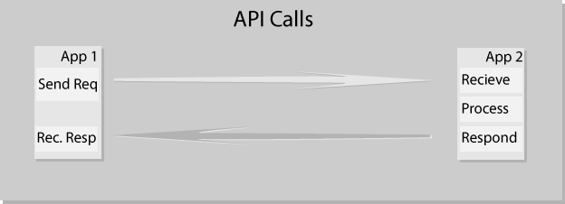

# Snakes!.py
## Random talk about python

---

## About

* One of the fastest growing languages
* Can integrate with various technologies
* decent amount of built in packages
* PyPI (Python Package Index)
* PIP (Package Installer for Python)
* Typically installed by default with linux
* python vs python3

---

## About (cont'd)

* Designed to be lightweight, utilize other languages other leaning wholly on python itself
* Originated in 1991
* Made by Guido van Rossum
* Named after Monty Python's Flying Circus
* Current Ran by [Python Software Foundation](https://www.python.org/psf/)
* extensible in C or C++
    * http://scipy-lectures.org/advanced/interfacing_with_c/interfacing_with_c.html
* syntax is a bit more english like

<!--.notes : test note (press 2)

.footnote: Testeruni -->

# Presenter Notes

- test 1 (press p)
- opens a new window
- was python really named after monty python?
- Curses doesn't work in windows (default python library)
- TKinter issues back college
- https://docs.python.org/2/faq/general.html#what-is-python

---

# The Great 3 debacle

* Slow adoption rate
* 2.x EoL 2020 even though 3 has been out since 2008.
* key changes that require a lot of action to port packages
<!-- * https://docs.python.org/3/howto/pyporting.html -->

# Presenter Notes

- IIRC EoL was originally supposed to be 2014 or something
- 
---

### Python vs. Node

<!--  -->

- Python is best utilized for data driven instances, although can be used for many other things
    - Handy for dealing with other languages
- Node is best suited as a web server
    - mostly focused on javascript use
- No core libraries for node
<!-- https://docs.python.org/3/library/ -->
<!-- https://hackernoon.com/python-vs-nodejs-which-programming-language-to-choose-98721d6526f2 -->

---

### Python vs. Node (cont'd)

* Package Management: Npm - PIP / PYPI
* project metadata: package.json - requirements.txt
* Curly Brackets - Tabs
* 2009 - 1991

# Presenter Notes

- [info on requirements.txt](https://pip.readthedocs.io/en/1.1/requirements.html)

Example: 

`MyApp`
`Framework==0.9.4`
`Library>=0.2`

---

# Live Demo / Code Comparison

---

# The future

- Machine Learning, AI
- Other integrated projects (openCV)

---

### Things to checkout

* Talk Python to me / Python Bytes (python podcasts)

---

# Thanks!